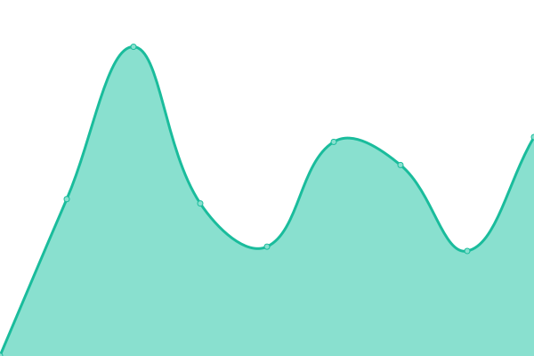
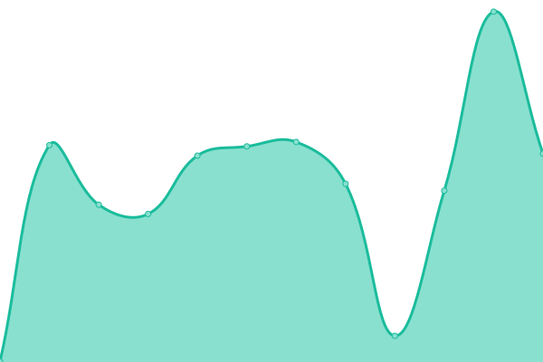
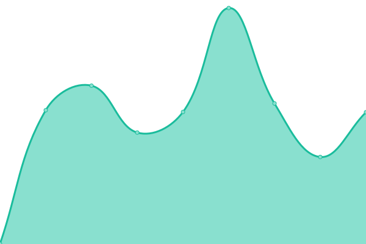
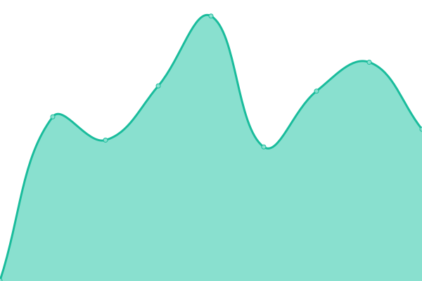
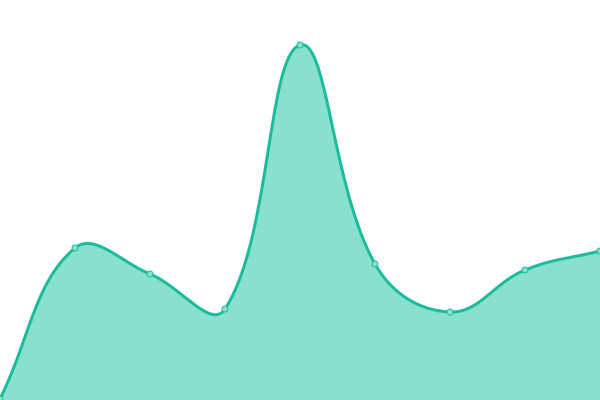

# [📈 Live Status](https://uptime.wicloz.rocks): <!--live status--> **🟩 All systems operational**

This repository contains the open-source uptime monitor and status page for [Wilco de Boer](https://uptime.wicloz.rocks), powered by [Upptime](https://github.com/upptime/upptime).

With [Upptime](https://upptime.js.org), you can get your own unlimited and free uptime monitor and status page, powered entirely by a GitHub repository. We use [Issues](https://github.com/Wicloz/upptime/issues) as incident reports, [Actions](https://github.com/Wicloz/upptime/actions) as uptime monitors, and [Pages](https://uptime.wicloz.rocks) for the status page.

<!--start: status pages-->
<!-- This summary is generated by Upptime (https://github.com/upptime/upptime) -->
<!-- Do not edit this manually, your changes will be overwritten -->
<!-- prettier-ignore -->
| URL | Status | History | Response Time | Uptime |
| --- | ------ | ------- | ------------- | ------ |
|  [Munin](https://munin.wicloz.rocks/) | 🟩 Up | [munin.yml](https://github.com/Wicloz/upptime/commits/HEAD/history/munin.yml) | 

 654ms
     
 | 

<a href="https://uptime.wicloz.rocks/history/munin">95.26%</a>
    

|  [SearX](https://searx.wicloz.rocks/) | 🟩 Up | [sear-x.yml](https://github.com/Wicloz/upptime/commits/HEAD/history/sear-x.yml) | 

 678ms
     
 | 

<a href="https://uptime.wicloz.rocks/history/sear-x">95.30%</a>
    

|  [Nextcloud](https://cloud.wicloz.rocks/) | 🟩 Up | [nextcloud.yml](https://github.com/Wicloz/upptime/commits/HEAD/history/nextcloud.yml) | 

 1138ms
     
 | 

<a href="https://uptime.wicloz.rocks/history/nextcloud">95.35%</a>
    

|  [RoundCube](https://peamail.net/) | 🟩 Up | [round-cube.yml](https://github.com/Wicloz/upptime/commits/HEAD/history/round-cube.yml) | 

 461ms
     
 | 

<a href="https://uptime.wicloz.rocks/history/round-cube">95.40%</a>
    

|  [MTG Saga](https://mtgsaga.wicloz.rocks/) | 🟩 Up | [mtg-saga.yml](https://github.com/Wicloz/upptime/commits/HEAD/history/mtg-saga.yml) | 

 2923ms
     
 | 

<a href="https://uptime.wicloz.rocks/history/mtg-saga">95.49%</a>
    

|  [MusicDL](https://musicdl.wicloz.rocks/) | 🟩 Up | [music-dl.yml](https://github.com/Wicloz/upptime/commits/HEAD/history/music-dl.yml) | 

 2907ms
     
 | 

<a href="https://uptime.wicloz.rocks/history/music-dl">95.59%</a>
    

|  [LMS](https://lms.wicloz.rocks/) | 🟩 Up | [lms.yml](https://github.com/Wicloz/upptime/commits/HEAD/history/lms.yml) | 

 2882ms
     
 | 

<a href="https://uptime.wicloz.rocks/history/lms">95.68%</a>
    

|  [Invoice Ninja](https://invoices.wicloz.rocks/) | 🟩 Up | [invoice-ninja.yml](https://github.com/Wicloz/upptime/commits/HEAD/history/invoice-ninja.yml) | 

 4866ms
     
 | 

<a href="https://uptime.wicloz.rocks/history/invoice-ninja">95.76%</a>
    

|  [Rocket.Chat](https://chat.wicloz.rocks/) | 🟩 Up | [rocket-chat.yml](https://github.com/Wicloz/upptime/commits/HEAD/history/rocket-chat.yml) | 

 4764ms
     
 | 

<a href="https://uptime.wicloz.rocks/history/rocket-chat">95.78%</a>
    

|  [Gitea](https://git.wicloz.rocks/) | 🟩 Up | [gitea.yml](https://github.com/Wicloz/upptime/commits/HEAD/history/gitea.yml) | 

 1521ms
     
 | 

<a href="https://uptime.wicloz.rocks/history/gitea">95.81%</a>
    

|  [Vaultwarden](https://vault.wicloz.rocks/) | 🟩 Up | [vaultwarden.yml](https://github.com/Wicloz/upptime/commits/HEAD/history/vaultwarden.yml) | 

 565ms
     
 | 

<a href="https://uptime.wicloz.rocks/history/vaultwarden">95.86%</a>
    

|  [DayTick](https://todo.wicloz.rocks/) | 🟩 Up | [day-tick.yml](https://github.com/Wicloz/upptime/commits/HEAD/history/day-tick.yml) | 

 4738ms
     
 | 

<a href="https://uptime.wicloz.rocks/history/day-tick">95.87%</a>
    

|  [Transmission Web](https://torrents.wicloz.rocks/) | 🟩 Up | [transmission-web.yml](https://github.com/Wicloz/upptime/commits/HEAD/history/transmission-web.yml) | 

 4721ms
     
 | 

<a href="https://uptime.wicloz.rocks/history/transmission-web">95.88%</a>
    

|  [phpMyAdmin](https://myadmin.wicloz.rocks/) | 🟩 Up | [php-my-admin.yml](https://github.com/Wicloz/upptime/commits/HEAD/history/php-my-admin.yml) | 

 4659ms
     
 | 

<a href="https://uptime.wicloz.rocks/history/php-my-admin">95.89%</a>
    

|  [phpPgAdmin](https://pgadmin.wicloz.rocks/) | 🟩 Up | [php-pg-admin.yml](https://github.com/Wicloz/upptime/commits/HEAD/history/php-pg-admin.yml) | 

 4779ms
     
 | 

<a href="https://uptime.wicloz.rocks/history/php-pg-admin">95.91%</a>
    

|  [SSH](home.wicloz.rocks) | 🟩 Up | [ssh.yml](https://github.com/Wicloz/upptime/commits/HEAD/history/ssh.yml) | 

 110ms
     
 | 

<a href="https://uptime.wicloz.rocks/history/ssh">100.00%</a>
    

|  [SMTP](peamail.net) | 🟩 Up | [smtp.yml](https://github.com/Wicloz/upptime/commits/HEAD/history/smtp.yml) | 

 111ms
     
 | 

<a href="https://uptime.wicloz.rocks/history/smtp">100.00%</a>
    

|  [submissions](peamail.net) | 🟩 Up | [submissions.yml](https://github.com/Wicloz/upptime/commits/HEAD/history/submissions.yml) | 

 111ms
     
 | 

<a href="https://uptime.wicloz.rocks/history/submissions">100.00%</a>
    

|  [submission](peamail.net) | 🟩 Up | [submission.yml](https://github.com/Wicloz/upptime/commits/HEAD/history/submission.yml) | 

 111ms
     
 | 

<a href="https://uptime.wicloz.rocks/history/submission">100.00%</a>
    

|  [IMAPS](peamail.net) | 🟩 Up | [imaps.yml](https://github.com/Wicloz/upptime/commits/HEAD/history/imaps.yml) | 

 111ms
     
 | 

<a href="https://uptime.wicloz.rocks/history/imaps">100.00%</a>
    

<!--end: status pages-->

[**Visit our status website →**](https://uptime.wicloz.rocks)

## 📄 License

- Powered by: [Upptime](https://github.com/upptime/upptime)
- Code: [MIT](./LICENSE) © [Wilco de Boer](https://uptime.wicloz.rocks)
- Data in the `./history` directory: [Open Database License](https://opendatacommons.org/licenses/odbl/1-0/)
